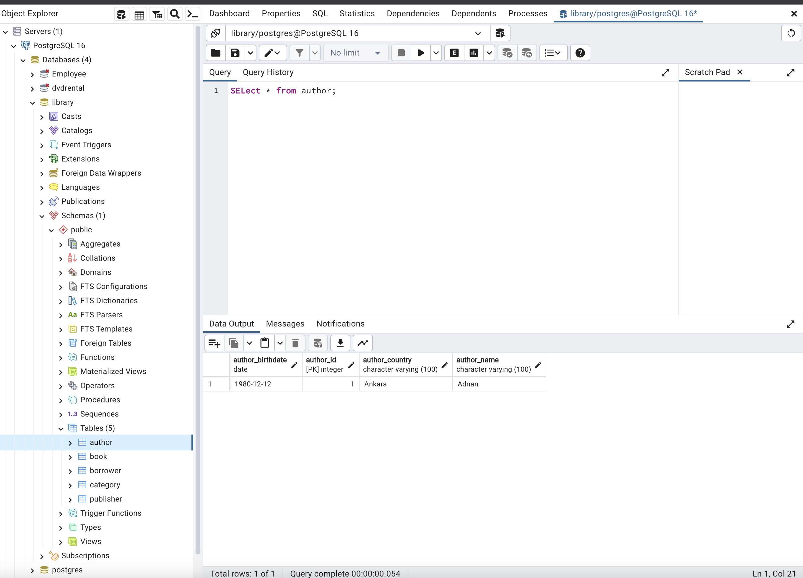

# In this study, we aimed to learn how to use hibernate and set up table relationships. We will leave the JDBC connection and now we have switched to ORM and JPA applications

 The tables created in the database are as follows. One sample data has been added.

# There are onetomany, manytomany relations between the tables.

# Requirements

<ul>
<li>Open Maven java project and define dependencies</li>

<li>Required annotations (@Entity, @Table, @Id, @OneToMany, @ManyToOne, @ManyToMany) written</li>

<li>Written the necessary Fetch and Cascade annotations</li>

<li>PostgreSQL was used as database</li>
</ul>

